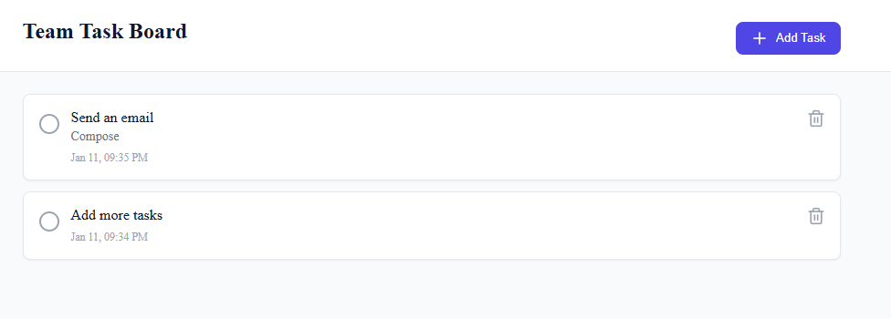

# Team Task Board - Microsoft Teams Tab App

A simple and intuitive task management application built as a Microsoft Teams tab. Track your team's tasks, mark them as complete, and keep everyone organized right within Teams.

## Features

- ✅ Create tasks with titles and descriptions
- ✅ Mark tasks as complete/incomplete
- ✅ Delete tasks
- ✅ Clean, modern interface
- ✅ Works in Teams, Outlook, and Microsoft 365 app

## Get started with the Team Task Board

> **Prerequisites**
>
> To run this app in your local dev machine, you will need:
>
> - [Node.js](https://nodejs.org/), supported versions: >=20.
> - A [Microsoft 365 account for development](https://docs.microsoft.com/microsoftteams/platform/toolkit/accounts)
>   Please note that after you enrolled your developer tenant in Office 365 Target Release, it may take couple days for the enrollment to take effect.
> - [Microsoft 365 Agents Toolkit Visual Studio Code Extension](https://aka.ms/teams-toolkit) version 6.0.0 and higher or [Microsoft 365 Agents Toolkit CLI](https://aka.ms/teamsfx-toolkit-cli)

### Running the app

1. First, select the Microsoft 365 Agents Toolkit icon on the left in the VS Code toolbar.
2. In the Account section, sign in with your [Microsoft 365 account](https://docs.microsoft.com/microsoftteams/platform/toolkit/accounts) if you haven't already.
3. Press F5 to start debugging which launches your app in Teams using a web browser. Select `Debug in Teams (Edge)` or `Debug in Teams (Chrome)`.
4. When Teams launches in the browser, select the Add button in the dialog to install your app to Teams.

**Congratulations**! You can now manage tasks directly within Microsoft Teams.

## What's included in the project

| Folder       | Contents                                     |
| ------------ | -------------------------------------------- |
| `.vscode`    | VSCode files for debugging                   |
| `appPackage` | Templates for the application manifest |
| `env`        | Environment files                            |
| `infra`      | Templates for provisioning Azure resources   |
| `src`        | The source code for the application    |

### Key files

| File                             | Contents                                                                                                        |
| -------------------------------- | --------------------------------------------------------------------------------------------------------------- |
| `index.html`                     | HTML entry point for the app.                                                                                   |
| `src/Tab/App.css`                | CSS styling for the task board interface.                                                                       |
| `src/Tab/App.tsx`                | Main application logic - handles task creation, completion, and deletion. Uses React hooks for state management.|
| `src/index.ts`                   | App initialization using [Microsoft Teams SDK](https://aka.ms/teams-ai-library-v2).                            |
| `vite.config.js`                 | Configuration for Vite build tool.                                                                              |  
| `nodemon.json`                   | Configuration for Nodemon to watch and restart the server.                                                      |

### Microsoft 365 Agents Toolkit files

| File                 | Contents                                                                                                                                  |
| -------------------- | ----------------------------------------------------------------------------------------------------------------------------------------- |
| `m365agents.yml`       | Main Microsoft 365 Agents Toolkit project file defining properties and configuration stages. |
| `m365agents.local.yml` | Overrides `m365agents.yml` with actions that enable local execution and debugging.                                                     |

## How it works

The app uses React with TypeScript to manage tasks in state. Key features:

- **Task Management**: Add, complete, and delete tasks
- **State Management**: Uses React `useState` hook to manage task list
- **Teams Integration**: Initializes Microsoft Teams JavaScript SDK for proper integration
- **Task Structure**: Each task has an id, title, description, completion status, and creation timestamp

## Future enhancements

- 🔄 Persist tasks using browser storage or backend service
- 👥 Multi-user collaboration with real-time updates
- 🏷️ Task categories and tags
- 📅 Due dates and reminders
- 🔍 Search and filter tasks

## Extend the app

- [Add or manage the environment](https://learn.microsoft.com/microsoftteams/platform/toolkit/teamsfx-multi-env)
- [Create multi-capability app](https://learn.microsoft.com/microsoftteams/platform/toolkit/add-capability)
- [Access data in Microsoft Graph](https://learn.microsoft.com/microsoftteams/platform/toolkit/teamsfx-sdk#microsoft-graph-scenarios)
- [Use an existing Microsoft Entra application](https://learn.microsoft.com/microsoftteams/platform/toolkit/use-existing-aad-app)
- [Customize the app manifest](https://learn.microsoft.com/microsoftteams/platform/toolkit/teamsfx-preview-and-customize-app-manifest)
- Host your app in Azure by [provision cloud resources](https://learn.microsoft.com/microsoftteams/platform/toolkit/provision) and [deploy the code to cloud](https://learn.microsoft.com/microsoftteams/platform/toolkit/deploy)
- [Collaborate on app development](https://learn.microsoft.com/microsoftteams/platform/toolkit/teamsfx-collaboration)
- [Set up the CI/CD pipeline](https://learn.microsoft.com/microsoftteams/platform/toolkit/use-cicd-template)
- [Publish the app to your organization or the Microsoft app store](https://learn.microsoft.com/microsoftteams/platform/toolkit/publish)
- [Enable the app for multi-tenant](https://aka.ms/m365-agent-multi-tenancy-entra-app)
- [Preview the app on mobile clients](https://aka.ms/teamsfx-mobile)